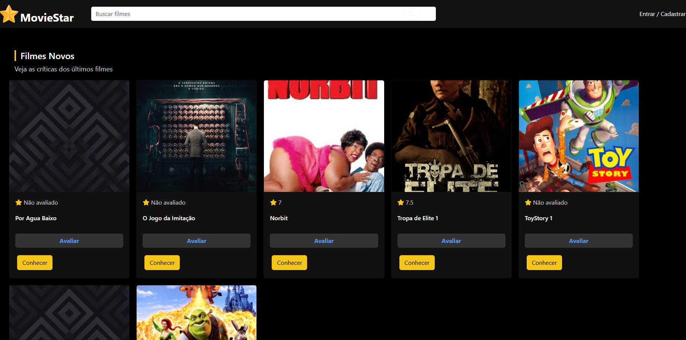
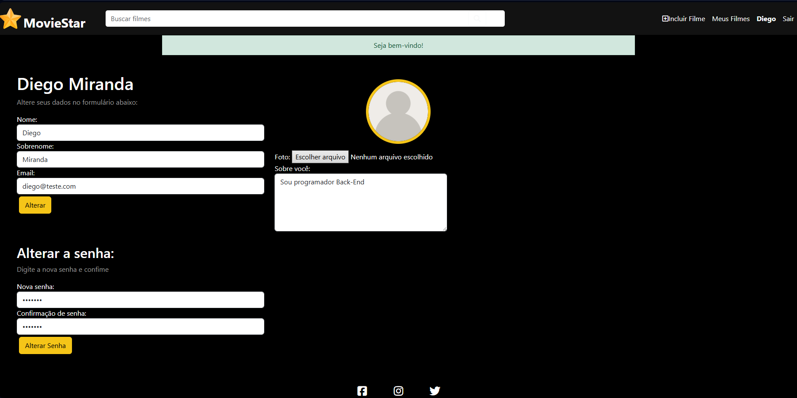
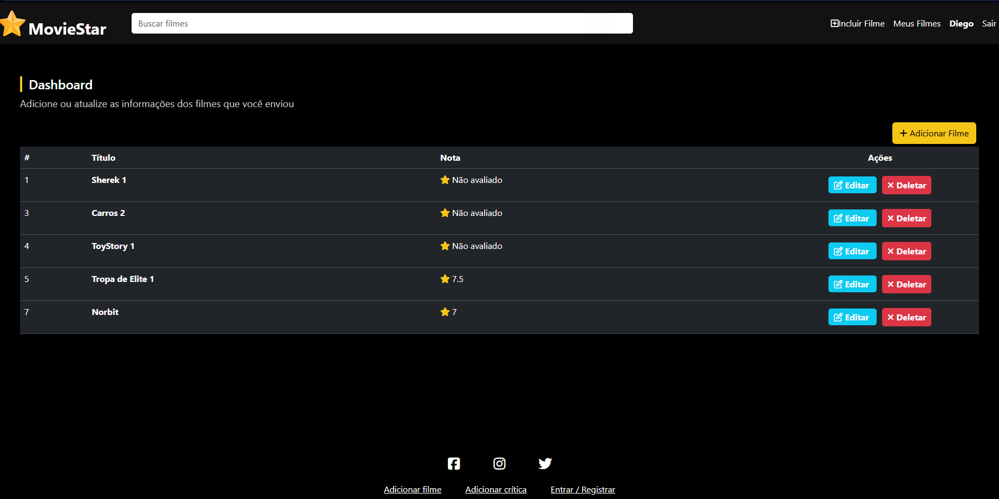

<h1 align="center" style="font-weight: bold;">MovieStar 🎬⭐</h1>

<p align="center">
 <a href="#sobre">Sobre</a> • 
 <a href="#tecnologias">Tecnologias</a> • 
 <a href="#funcionalidades">Funcionalidades</a> • 
 <a href="#como-rodar">Como Rodar</a> • 
 <a href="#preview">Preview</a> 
</p>

<h2 id="sobre">🎯 Sobre</h2>

MovieStar é um **site interativo para fãs de cinema**, onde os usuários podem criar contas, modificar seus perfis (foto, bio etc.), adicionar filmes e avaliar filmes de outros usuários.  
O sistema foi desenvolvido com **PHP e MySQL**, utilizando **Bootstrap e HTML** no front-end, e implementa diversas práticas de back-end, como validação de formulários, autenticação, permissões e manipulação de dados de forma segura.  

O projeto foi criado para estudo e prática avançada de desenvolvimento web, com foco em **CRUD, sessões, segurança e interatividade**.  

<h2 id="tecnologias">💻 Tecnologias</h2>

<div>
  
  <span>PHP</span>
</div>
<div>
  
  <span>MySQL</span>
</div>
<div>
  
  <span>HTML</span>
</div>
<div>
  
  <span>CSS</span>
</div>
<div>
  
  <span>Bootstrap</span>
</div>

<h2 id="funcionalidades">🕹️ Funcionalidades</h2>

- **Cadastro e Login de Usuários**: Sistema de autenticação com validação e segurança.  
- **Perfis Personalizados**: Usuários podem editar foto, bio e informações pessoais.  
- **Adicionar Filmes**: Cada usuário pode cadastrar novos filmes no sistema.  
- **Avaliação de Filmes**: Usuários podem avaliar filmes de outros, com notas individuais.  
- **CRUD Completo**: Criar, ler, atualizar e deletar filmes e avaliações.  
- **Validação e Segurança**: Validação de formulários, controle de permissões e proteção básica contra SQL Injection.  
- **Interface Responsiva**: Layout moderno e adaptável com Bootstrap.  

<h2 id="como-rodar">🚀 Como Rodar</h2>

### Pré-requisitos

- **Servidor Web com PHP** (XAMPP, WAMP, Laragon ou similar)  
- **Banco de Dados MySQL**  
- Navegador moderno (Chrome, Edge, Firefox etc.)  

### Passos para rodar

1️⃣ Clone o repositório:
```bash
git clone https://github.com/Dieegoo13/MovieStars.git
````

<h2 id="preview">📸 Preview do Projeto</h2>

  

  

  
